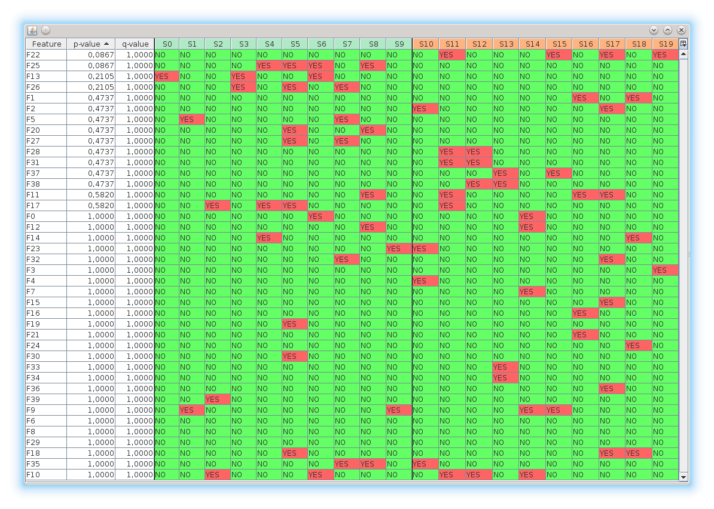

The `gc4s-statistics-tests-table` module
========================================

This module provides the `StatisticsTestTable` component to display datasets in customizable tables and automatically compute p-values and q-values to compare conditions. By using this module, it is also possible to use the main `gc4s` components.

The `gc4s-statistics-tests-table-demo` provides different examples of usage of these components with sample data. Javadoc documentation is available [here](http://sing-group.org/gc4s/javadoc/).



Using this module
-----------------
Add the following repository and dependency declarations to your `pom.xml`:
```xml
	<repositories>
		<repository>
			<id>sing-repository</id>
			<name>SING repository</name>
			<url>http://maven.sing-group.org/repository/maven/</url>
		</repository>
	</repositories>
	
	<dependencies>
		<dependency>
			<groupId>org.sing_group</groupId>
			<artifactId>gc4s-statistics-tests-table</artifactId>
			<version>1.5.0</version>
		</dependency>
	</dependencies>
```

A simple example
-----------------
The following code (available at `org.sing_group.org.gc4s.statistics.table.MinimalTableDemo` of the demo module) shows the minimum code required to create a table and set some renderers and highlighters provided by the library.
```java
import static org.sing_group.gc4s.visualization.VisualizationUtils.showComponent;
import static org.sing_group.org.gc4s.statistics.data.tests.StatisticsTestsUtils.decideBooleanStatisticTest;
import static org.sing_group.org.gc4s.statistics.data.util.StatisticsTestsDataUtils.randomValues;
import static org.sing_group.org.gc4s.statistics.table.TableDemoUtils.PROGRESS_EVENT_LISTENER;
import static org.sing_group.org.gc4s.statistics.table.TableDemoUtils.conditionNames;
import static org.sing_group.org.gc4s.statistics.table.TableDemoUtils.features;
import static org.sing_group.org.gc4s.statistics.table.TableDemoUtils.samples;

import java.util.Arrays;
import java.util.List;

import javax.swing.JFrame;
import javax.swing.JScrollPane;

import org.sing_group.org.gc4s.statistics.data.Dataset;
import org.sing_group.org.gc4s.statistics.data.DefaultDataset;
import org.sing_group.org.gc4s.statistics.data.tests.FdrCorrection;
import org.sing_group.org.gc4s.statistics.data.tests.PValuesCorrection;
import org.sing_group.org.gc4s.statistics.data.tests.Test;
import org.sing_group.org.gc4s.statistics.data.tests.TwoConditionsBooleanFisherTest;
import org.sing_group.org.gc4s.statistics.table.ui.BooleanHighlighter;
import org.sing_group.org.gc4s.statistics.table.ui.ConditionsSeparatorHighlighter;
import org.sing_group.org.gc4s.statistics.table.ui.StatisticsTestTableHeaderRenderer;
import org.sing_group.org.gc4s.statistics.table.ui.YesNoTableCellRenderer;

public class MinimalTableDemo {
	public static void main(String[] args) {
		String[] features = new String[] { "F1", "F2" };
		String[] samples = new String[] { "S1", "S2", "S3", "S4" };

		final Boolean[][] data = new Boolean[][] { 
			{ true, true, false, false },
			{ false, false, true, true } 
		};

		String[] conditionNames = new String[] { "A", "A", "B", "B" };

		Dataset<Boolean> dataset = 
			new DefaultDataset<>(features, samples, data, conditionNames);

		Test<Boolean> test = new TwoConditionsBooleanFisherTest();
		PValuesCorrection correction = new FdrCorrection();

		StatisticsTestTable<Boolean> table = 
			new StatisticsTestTable<>(dataset, test, correction);

		table.setDefaultRenderer(Boolean.class, new YesNoTableCellRenderer());
		
		table.getTableHeader().setDefaultRenderer(
			new StatisticsTestTableHeaderRenderer(
				table.getTableHeader().getDefaultRenderer(), 1)
		);
		
		table.setHighlighters(
			new BooleanHighlighter(), 
			new ConditionsSeparatorHighlighter<>(table)
		);

		showComponent(new JScrollPane(table), JFrame.MAXIMIZED_BOTH);
	}
}
```
